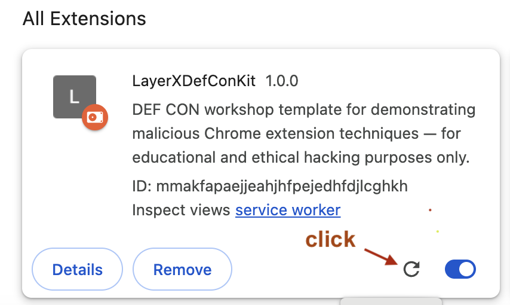
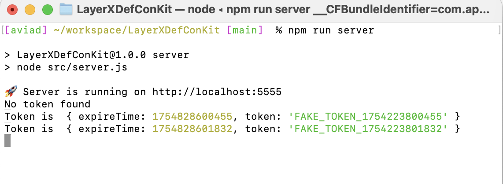

# LayerXDefConKit – Chrome Extension Boilerplate

A lean Chrome Extension boilerplate built for DEF CON demos and security research.
Built with Manifest V3, powered by Webpack, this template is designed for rapid prototyping of both benign and malicious Chrome extension behavior.

## ⚠️ Disclaimer

This project is intended strictly for educational and ethical research purposes.
It must not be used to develop or distribute malicious software.
Always respect user privacy and platform policies.

## Pre-requisite

- [NodeJs](https://nodejs.org/) `v17.4.0`

### 🛠️ Installing Node.js and npm

1. **Go to https://nodejs.org**
2. **Download the LTS version**
3. **Run the installer** and follow the setup instructions

### ✅ Verify Installation

After installation, open a terminal or command prompt and run:

```bash
node -v
npm -v
```

## Project setup

- Clone the repository

```bash
git clone https://github.com/aviadgispan/LayerXDefConKit.git
cd LayerXDefConKit
```

- Install dependencies

```
npm install
```

- Build for production

```
npm run build
```

- Start working on locally

```
npm run start
```

- Start the server (runs on port 5555)

```
npm run server
```

## Load extension in browser locally

- Turn on developer mode in (`chrome://extensions`)
  

- Then click on `Load unpacked`
- Select `dist` folder inside this repo folder(It will get generated after running either `build` or `start` command)

- If you have run `start` command, you can see something like this in browser console
  

## 🔄 How to Verify the Server Is Working

To make sure your `server.js` is running correctly and the extension is successfully receiving a token from the server:

### 1. Start working locally

Run the following command to start the server locally:

```bash
npm run start
```

### 2. Start the server

Run the following command in your terminal:

```bash
npm run server
```

### 3. Open the Chrome Extensions page

Navigate to: (`chrome://extensions`)

Find the extension named LayerXDefConKit, and click the 🔄 refresh icon:



Each time you refresh the extension, it makes a request to the local server and receives a new token.

### 4. Verify the terminal output

After refreshing the extension, you should see output like this in your terminal:



A new token will be logged every time the extension is refreshed.
If you see this behavior — everything is working correctly ✅

## 🧭 Workshop Branches

The workshop is structured as a series of Git branches. Start at the first step and move forward — each branch contains the solution to the previous task.

| Branch Name                                           | Description                                                                                                       | Solution Link                                                                                   |
| ----------------------------------------------------- | ----------------------------------------------------------------------------------------------------------------- | ----------------------------------------------------------------------------------------------- |
| `main`                                                | Starting point. Exercise: activate cookies stealing                                                               | [View Solution](https://github.com/aviadgispan/LayerXDefConKit/pull/1/files)                    |
| `step-1-fetch-injection`                              | Exercise: Injecting Code into the Main World to Override fetch (Only on chatgpt.com)                              | [View Solution](https://github.com/aviadgispan/LayerXDefConKit/pull/2/files)                    |
| `step-2-log-response-body`                            | Exercise: Log the response body of intercepted fetch requests                                                     | [View Solution](https://github.com/aviadgispan/LayerXDefConKit/pull/3/files)                    |
| `step-3-inject-with-minimal-permission`               | Exercise: Use only the following permissions in your `manifest.json` cookies, tabs and storage                    | [View Solution](https://github.com/aviadgispan/LayerXDefConKit/pull/4/files)                    |
| `step-4-force-chat-gpt-to-answer-in-lyrics`           | Exercise: Force ChatGPT to answer in lyrics                                                                       | [View Solution](https://github.com/aviadgispan/LayerXDefConKit/pull/5/files)                    |
| `step-5-exfiltrate-the-data`                          | Exercise: Transfer the captured information to the remote server.                                                 | [View Solution](https://github.com/aviadgispan/LayerXDefConKit/pull/6/files)                    |
| `step-6-obfuscation-to-hide-injected-extension-logic` | Exercise: Add Webpack config to export obfuscated extension bundles.                                              | [View Solution](https://github.com/aviadgispan/LayerXDefConKit/pull/7/files)                    |
| `step-7-the-complete-solution`                        | Contains the final implementation of the extension, incorporating everything from all previous exercises solutoin | [View Branch](https://github.com/aviadgispan/LayerXDefConKit/tree/step-7-the-complete-solution) |
| `complete-solution-without-any-permission`            | This branch demonstrates how to manipulate ChatGpt without using any permissions.                                 | [View Solution](https://github.com/aviadgispan/LayerXDefConKit/pull/9/files)                    |
